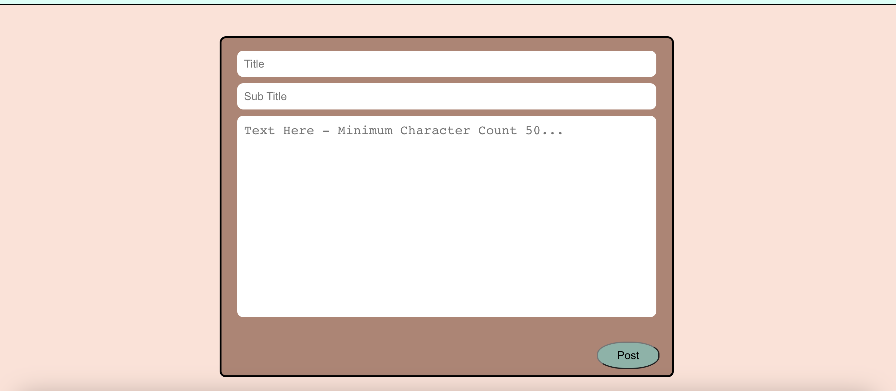
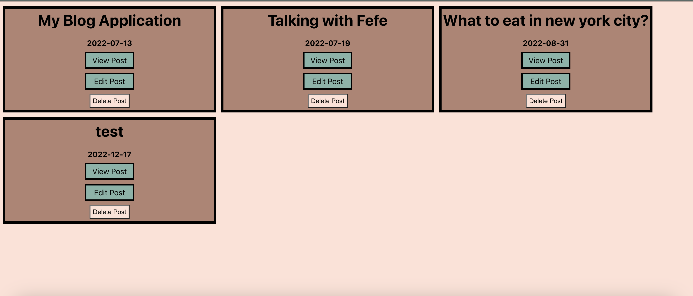
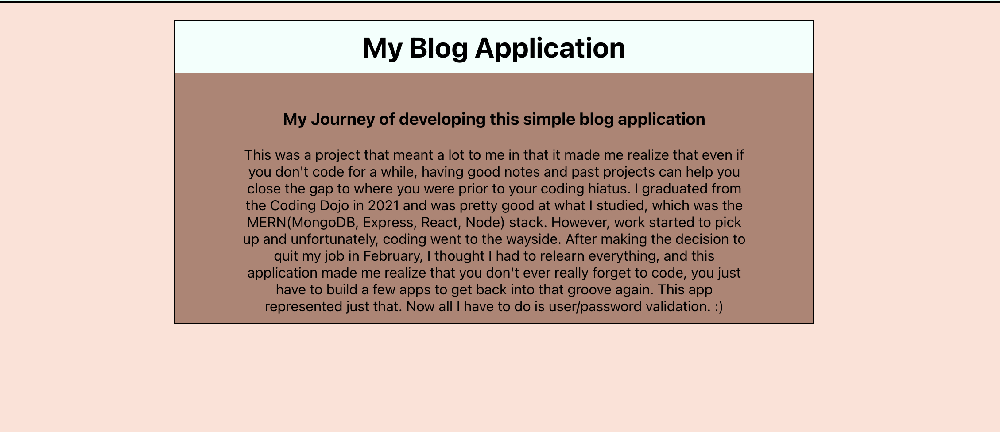
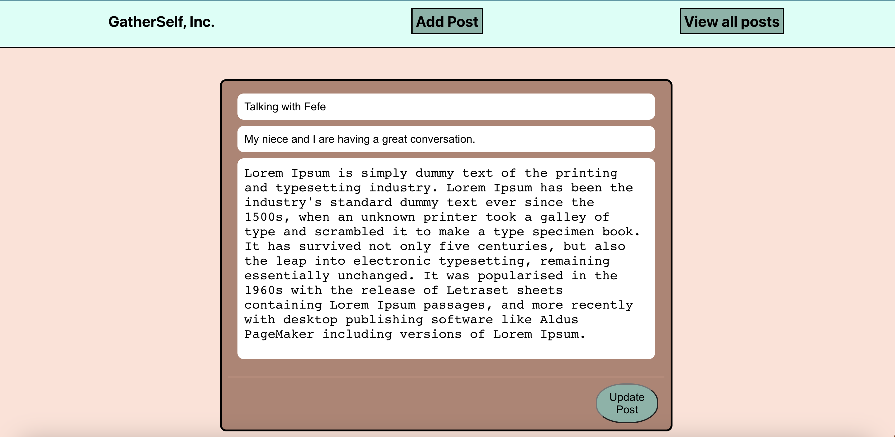
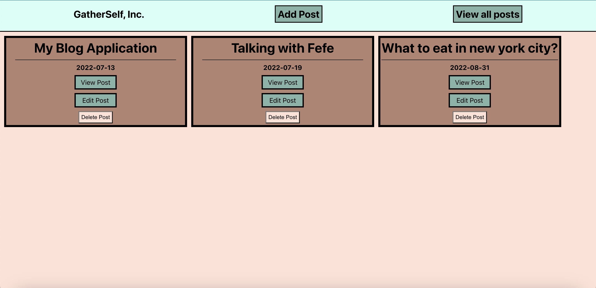

# Better-Self
This web application is a digital journal that allows you to chronicle your everyday life. 

## Features
* Create Posts
* Read Posts
* Update Post
* Delete Post

### Create Posts

### Read Posts

### Update Posts

### Delete Posts 

## Installation
* Form and clone this repository
* Install NPM packages by running npm install
* Run npm start to open the application in your browser

[Live Website](https://redditprime.netlify.app/)

## Technologies Used 

Utilized a MERN stack to build app
* React.js
* Express
* MongoDB
* NodeJs

Other Technologies Used
* Axios
* Netlify

## Planning Process
* Created Backend and MongoDB Schema
* Tested Routes with Postman
* Created front end

# Stay Connected
I am Reginald Jean Amedee, a full-stack software engineer and web developer. Thank you for checking out my work. You can reach out to me at @jeantechnical1992@gmail.com or you can follow me on [Linkedin](https://www.linkedin.com/in/reginaldamedee/)